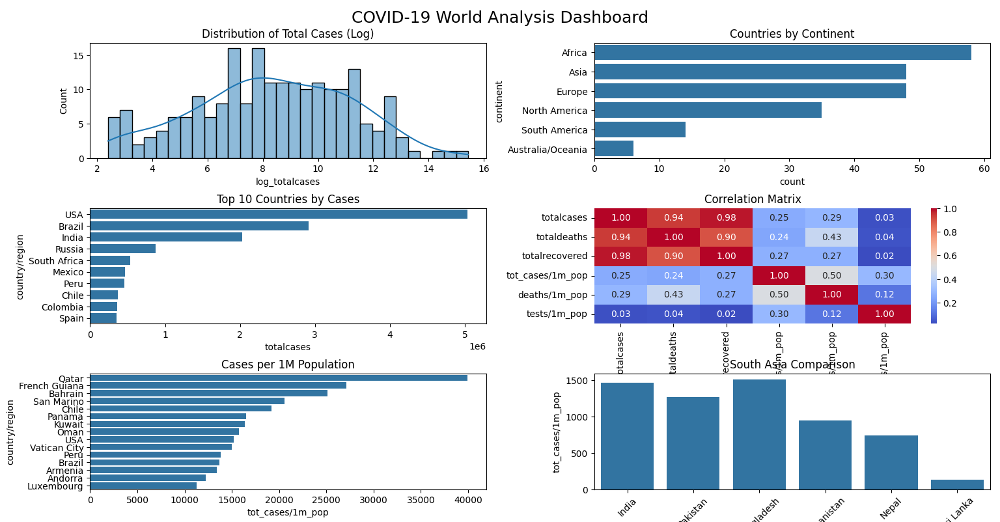

# COVID-19 World Analysis Dashboard

Exploratory data analysis of global COVID-19 statistics using the [Worldometer](https://www.worldometers.info/coronavirus/) dataset. The project cleans raw country-level data, handles missing values and outliers, and produces a six-panel dashboard visualizing global case distribution, regional trends, and a South Asia comparison.

## Dataset

- **File:** `worldometer_data.csv`
- **Source:** Worldometer COVID-19 country-level snapshot
- **Granularity:** One row per country/region

## Requirements

```bash
pip install pandas numpy matplotlib seaborn
```

## Workflow

### 1. Data Cleaning
- Standardizes column names to lowercase with underscores
- Fills missing `who_region` values with `"Unknown"`
- Fills missing `tests/1m_pop` with the column mean
- Fills other missing numerical columns (`population`, `totaldeaths`, `totalrecovered`, `serious,critical`, `tot_cases/1m_pop`, `deaths/1m_pop`, `totaltests`) with their medians
- Fills missing `continent` with the mode
- Drops daily-change columns not needed for this snapshot analysis: `newcases`, `newrecovered`, `newdeaths`, `activecases`

### 2. Outlier Detection
Uses the IQR method (1.5x interquartile range) to flag outliers in:
- `totalcases`
- `totaldeaths`
- `totalrecovered`
- `tot_cases/1m_pop`
- `deaths/1m_pop`

Outlier counts are printed to the console for each column.

### 3. Log Transformation
Applies `log1p` transformation to reduce right-skew in heavily skewed count columns:
- `totalcases` → `log_totalcases`
- `totaldeaths` → `log_totaldeaths`
- `totalrecovered` → `log_totalrecovered`
- `totaltests` → `log_totaltests`

### 4. Visualization Dashboard
A 3x2 `matplotlib`/`seaborn` grid summarizing the cleaned data:

| Panel | Chart | Description |
|---|---|---|
| 1 | Histogram + KDE | Distribution of log-transformed total cases |
| 2 | Count plot | Number of countries per continent |
| 3 | Bar chart | Top 10 countries by total cases |
| 4 | Heatmap | Correlation matrix across key case/death/testing metrics |
| 5 | Bar chart | Top 15 countries by cases per 1M population |
| 6 | Bar chart | South Asia comparison (Nepal, India, Pakistan, Bangladesh, Sri Lanka, Afghanistan) by cases per 1M population |

## Usage

```bash
visual.py
```

This will print outlier counts to the console and display the dashboard figure.

## Output




## Notes

- Median imputation is used for skewed count-based columns to reduce sensitivity to extreme values; mean imputation is used only for `tests/1m_pop`.
- The IQR outlier check is diagnostic only in this script — outliers are reported but not removed, since extreme values (e.g., the US, India) are meaningful in a global pandemic dataset rather than noise.
